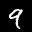

# LeNet 實作團

## mAiLab_0003：MNIST and LeNet

題目：[mAiLab_0003：MNIST and LeNet](http://hemingwang.blogspot.tw/2017/04/mailab0003mnist-and-lenet.html)

實作團目錄：[LeNet 實作團（目錄）](http://hemingwang.blogspot.tw/2017/04/lenet.html)

### 1、建議的環境變數（Windows）

* 進到【控制台】→【系統及安全性】→【系統】→【進階系統設定】→【進階】標籤→【環境變數(N)...】→在【%USERNAME% 的使用者變數(U)】新增環境變數。

``` bat
> set GOROOT="C:\Go"
> set GOPATH="%USERPROFILE%\go;%USERPROFILE%\work"
> set GOBIN="%USERPROFILE%\go\bin"
> set PATH="%PATH%;%GOROOT%\bin;%GOBIN%;%USERPROFILE%\work\bin"
```

### 1、建議的環境變數（Linux，macOS）

``` bash
$ vim "$HOME/.bash_profile"
```

    export GOROOT="/usr/local/go"
    export GOPATH="$HOME/go:$HOME/work"
    export GOBIN="$HOME/go/bin"
    export PATH="$PATH:$GOROOT/bin:$GOBIN:$HOME/work/bin”

    source "$HOME/.profile"

``` bash
$ exec /bin/bash
```
### 2、執行與結果

#### （1）執行

``` bat
> cd %USERPROFILE%\work\src\github.com\LeNetPractice\mAiLab_0003\example\
> go run main.go
```

#### （2）會將處理後的答案，儲存至 answer 目錄內。
* 若按照上方指令來執行，儲存目錄為 [%USERPROFILE%\work\src\github.com\LeNetPractice\mAiLab_0003\answer](%USERPROFILE%\work\src\github.com\LeNetPractice\mAiLab_0003\answer)。

##### a、解答 1、下載以下四個檔案。
* 會從 [http://yann.lecun.com/exdb/mnist](http://yann.lecun.com/exdb/mnist) 網站下載 MNIST 四個 .gz 檔至 answer 目錄，並進行解壓縮。

##### b、解答 2、輸出 train-images.idx3-ubyte 檔案中的第一個圖，大小為 28x28。
* 會將解答寫入至「answer/2. First images.txt」文字檔內。

	    00 00 00 00 00 00 00 00 00 00 00 00 00 00 00 00 00 00 00 00 00 00 00 00 00 00 00 00 
	    00 00 00 00 00 00 00 00 00 00 00 00 00 00 00 00 00 00 00 00 00 00 00 00 00 00 00 00 
	    00 00 00 00 00 00 00 00 00 00 00 00 00 00 00 00 00 00 00 00 00 00 00 00 00 00 00 00 
	    00 00 00 00 00 00 00 00 00 00 00 00 00 00 00 00 00 00 00 00 00 00 00 00 00 00 00 00 
	    00 00 00 00 00 00 00 00 00 00 00 00 00 00 00 00 00 00 00 00 00 00 00 00 00 00 00 00 
	    00 00 00 00 00 00 00 00 00 00 00 00 03 12 12 12 7E 88 AF 1A A6 FF F7 7F 00 00 00 00 
	    00 00 00 00 00 00 00 00 1E 24 5E 9A AA FD FD FD FD FD E1 AC FD F2 C3 40 00 00 00 00 
	    00 00 00 00 00 00 00 31 EE FD FD FD FD FD FD FD FD FB 5D 52 52 38 27 00 00 00 00 00 
	    00 00 00 00 00 00 00 12 DB FD FD FD FD FD C6 B6 F7 F1 00 00 00 00 00 00 00 00 00 00 
	    00 00 00 00 00 00 00 00 50 9C 6B FD FD CD 0B 00 2B 9A 00 00 00 00 00 00 00 00 00 00 
	    00 00 00 00 00 00 00 00 00 0E 01 9A FD 5A 00 00 00 00 00 00 00 00 00 00 00 00 00 00 
	    00 00 00 00 00 00 00 00 00 00 00 8B FD BE 02 00 00 00 00 00 00 00 00 00 00 00 00 00 
	    00 00 00 00 00 00 00 00 00 00 00 0B BE FD 46 00 00 00 00 00 00 00 00 00 00 00 00 00 
	    00 00 00 00 00 00 00 00 00 00 00 00 23 F1 E1 A0 6C 01 00 00 00 00 00 00 00 00 00 00 
	    00 00 00 00 00 00 00 00 00 00 00 00 00 51 F0 FD FD 77 19 00 00 00 00 00 00 00 00 00 
	    00 00 00 00 00 00 00 00 00 00 00 00 00 00 2D BA FD FD 96 1B 00 00 00 00 00 00 00 00 
	    00 00 00 00 00 00 00 00 00 00 00 00 00 00 00 10 5D FC FD BB 00 00 00 00 00 00 00 00 
	    00 00 00 00 00 00 00 00 00 00 00 00 00 00 00 00 00 F9 FD F9 40 00 00 00 00 00 00 00 
	    00 00 00 00 00 00 00 00 00 00 00 00 00 00 2E 82 B7 FD FD CF 02 00 00 00 00 00 00 00 
	    00 00 00 00 00 00 00 00 00 00 00 00 27 94 E5 FD FD FD FA B6 00 00 00 00 00 00 00 00 
	    00 00 00 00 00 00 00 00 00 00 18 72 DD FD FD FD FD C9 4E 00 00 00 00 00 00 00 00 00 
	    00 00 00 00 00 00 00 00 17 42 D5 FD FD FD FD C6 51 02 00 00 00 00 00 00 00 00 00 00 
	    00 00 00 00 00 00 12 AB DB FD FD FD FD C3 50 09 00 00 00 00 00 00 00 00 00 00 00 00 
	    00 00 00 00 37 AC E2 FD FD FD FD F4 85 0B 00 00 00 00 00 00 00 00 00 00 00 00 00 00 
	    00 00 00 00 88 FD FD FD D4 87 84 10 00 00 00 00 00 00 00 00 00 00 00 00 00 00 00 00 
	    00 00 00 00 00 00 00 00 00 00 00 00 00 00 00 00 00 00 00 00 00 00 00 00 00 00 00 00 
	    00 00 00 00 00 00 00 00 00 00 00 00 00 00 00 00 00 00 00 00 00 00 00 00 00 00 00 00 
	    00 00 00 00 00 00 00 00 00 00 00 00 00 00 00 00 00 00 00 00 00 00 00 00 00 00 00 00 
	    

##### c、解答 3、輸出 train-images.idx3-ubyte 檔案中前十個圖的平均圖，採無條件捨去，大小為 28x28。
* 會將解答寫入至「answer/3. Images 1 - 10 average.txt」文字檔內。

	    00 00 00 00 00 00 00 00 00 00 00 00 00 00 00 00 00 00 00 00 00 00 00 00 00 00 00 00 
	    00 00 00 00 00 00 00 00 00 00 00 00 00 00 00 00 00 00 00 00 00 00 00 00 00 00 00 00 
	    00 00 00 00 00 00 00 00 00 00 00 00 00 00 00 00 00 00 00 00 00 00 00 00 00 00 00 00 
	    00 00 00 00 00 00 00 00 00 00 00 00 00 00 00 00 00 00 00 00 00 00 00 00 00 00 00 00 
	    00 00 00 00 00 00 00 00 00 00 00 00 0E 19 15 08 0F 19 0F 05 00 00 12 13 00 00 00 00 
	    00 00 00 00 00 00 00 00 00 00 00 07 1C 2B 4D 3B 41 4A 5C 4D 42 45 35 1C 00 00 00 00 
	    00 00 00 00 06 08 00 00 03 07 17 26 3B 6D 88 6A 64 6D 78 6B 6B 59 31 0F 00 00 00 00 
	    00 00 00 00 0C 10 00 04 17 2B 32 37 5D A2 AC 8A 7B 73 65 79 80 5F 20 00 00 00 00 00 
	    00 00 00 00 16 10 00 01 15 25 41 65 95 B7 A1 6D 5E 78 6E 7F 7D 50 0A 00 00 00 00 00 
	    00 00 00 00 16 10 00 00 08 1A 31 68 95 A6 68 26 38 56 66 84 77 36 00 00 00 00 00 00 
	    00 00 00 04 18 10 00 00 00 21 4A 5B 7D 78 3D 3B 39 44 62 74 6D 35 05 00 00 00 00 00 
	    00 00 00 0C 19 10 00 00 11 2C 3F 46 4C 61 36 40 42 4E 65 6A 65 1E 10 00 00 00 00 00 
	    00 00 00 0F 19 0C 00 0D 2B 31 2C 20 2D 50 58 5D 55 5E 68 62 49 1B 13 00 00 00 00 00 
	    00 00 00 0F 19 06 01 1C 32 32 28 2C 25 6F 9B 90 7A 6A 64 41 25 19 13 00 00 00 00 00 
	    00 00 00 0F 19 08 02 2D 40 4A 3A 4F 69 B1 C8 BC 9D 71 52 1C 1D 19 13 00 00 00 00 00 
	    00 00 00 0F 19 17 1D 4D 65 72 7B 7D 95 B8 B3 BE 89 63 56 2E 19 19 0E 00 00 00 00 00 
	    00 00 00 00 0B 11 22 4A 60 60 4B 39 3A 5D 7E 82 69 6E 7C 5A 22 13 01 00 00 00 00 00 
	    00 00 00 00 00 00 1C 3C 39 19 16 17 1D 56 8A 7D 5A 6E 7A 60 36 19 06 04 04 00 00 00 
	    00 00 00 00 00 00 21 35 26 0A 19 19 24 5D 84 76 49 66 67 3A 10 18 19 19 16 00 00 00 
	    00 00 00 00 00 0A 22 39 20 01 20 2B 44 55 81 7D 73 6B 5B 1F 00 08 12 12 03 00 00 00 
	    00 00 00 00 00 1D 34 4A 30 34 39 4C 6A 5A 79 95 65 68 42 0F 00 00 00 00 00 00 00 00 
	    00 00 00 00 00 29 3A 4B 48 5D 67 76 6A 5F 85 8B 49 3D 25 09 00 00 00 00 00 00 00 00 
	    00 00 00 00 00 16 27 4C 5A 67 7B 7A 5B 48 5F 63 32 2B 1C 0F 00 00 00 00 00 00 00 00 
	    00 00 00 00 05 16 26 35 45 64 71 7A 39 19 3E 4B 22 2A 1D 0F 00 00 00 00 00 00 00 00 
	    00 00 00 00 0D 19 1A 23 2F 3A 37 21 02 00 1A 2E 16 0D 19 0F 00 00 00 00 00 00 00 00 
	    00 00 00 00 00 00 00 00 00 00 00 00 00 00 01 12 19 11 01 00 00 00 00 00 00 00 00 00 
	    00 00 00 00 00 00 00 00 00 00 00 00 00 00 00 01 0E 19 04 00 00 00 00 00 00 00 00 00 
	    00 00 00 00 00 00 00 00 00 00 00 00 00 00 00 00 00 00 00 00 00 00 00 00 00 00 00 00 
	    

##### d、解答 4、輸出 train-labels.idx1-ubyte 檔案中前十個 labels 的平均，精確度取至小數點以下兩位，採無條件捨去。
* 會將解答寫入至「answer/4. Labels 1 - 10 average.txt」文字檔內。

    03.00
    

##### e、解答 5、輸出 train-images.idx3-ubyte 檔案中的第一個圖，大小為 32x32。原圖置中，多出來的地方補 0。
* 會將解答寫入至「answer/5. First resized image.txt」文字檔內。

	    00 00 00 00 00 00 00 00 00 00 00 00 00 00 00 00 00 00 00 00 00 00 00 00 00 00 00 00 00 00 00 00 
	    00 00 00 00 00 00 00 00 00 00 00 00 00 00 00 00 00 00 00 00 00 00 00 00 00 00 00 00 00 00 00 00 
	    00 00 00 00 00 00 00 00 00 00 00 00 00 00 00 00 00 00 00 00 00 00 00 00 00 00 00 00 00 00 00 00 
	    00 00 00 00 00 00 00 00 00 00 00 00 00 00 00 00 00 00 00 00 00 00 00 00 00 00 00 00 00 00 00 00 
	    00 00 00 00 00 00 00 00 00 00 00 00 00 00 00 00 00 00 00 00 00 00 00 00 00 00 00 00 00 00 00 00 
	    00 00 00 00 00 00 00 00 00 00 00 00 00 00 00 00 00 00 00 00 00 00 00 00 00 00 00 00 00 00 00 00 
	    00 00 00 00 00 00 00 00 00 00 00 00 00 00 00 00 00 00 00 00 00 00 00 00 00 00 00 00 00 00 00 00 
	    00 00 00 00 00 00 00 00 00 00 00 00 00 00 03 12 12 12 7E 88 AF 1A A6 FF F7 7F 00 00 00 00 00 00 
	    00 00 00 00 00 00 00 00 00 00 1E 24 5E 9A AA FD FD FD FD FD E1 AC FD F2 C3 40 00 00 00 00 00 00 
	    00 00 00 00 00 00 00 00 00 31 EE FD FD FD FD FD FD FD FD FB 5D 52 52 38 27 00 00 00 00 00 00 00 
	    00 00 00 00 00 00 00 00 00 12 DB FD FD FD FD FD C6 B6 F7 F1 00 00 00 00 00 00 00 00 00 00 00 00 
	    00 00 00 00 00 00 00 00 00 00 50 9C 6B FD FD CD 0B 00 2B 9A 00 00 00 00 00 00 00 00 00 00 00 00 
	    00 00 00 00 00 00 00 00 00 00 00 0E 01 9A FD 5A 00 00 00 00 00 00 00 00 00 00 00 00 00 00 00 00 
	    00 00 00 00 00 00 00 00 00 00 00 00 00 8B FD BE 02 00 00 00 00 00 00 00 00 00 00 00 00 00 00 00 
	    00 00 00 00 00 00 00 00 00 00 00 00 00 0B BE FD 46 00 00 00 00 00 00 00 00 00 00 00 00 00 00 00 
	    00 00 00 00 00 00 00 00 00 00 00 00 00 00 23 F1 E1 A0 6C 01 00 00 00 00 00 00 00 00 00 00 00 00 
	    00 00 00 00 00 00 00 00 00 00 00 00 00 00 00 51 F0 FD FD 77 19 00 00 00 00 00 00 00 00 00 00 00 
	    00 00 00 00 00 00 00 00 00 00 00 00 00 00 00 00 2D BA FD FD 96 1B 00 00 00 00 00 00 00 00 00 00 
	    00 00 00 00 00 00 00 00 00 00 00 00 00 00 00 00 00 10 5D FC FD BB 00 00 00 00 00 00 00 00 00 00 
	    00 00 00 00 00 00 00 00 00 00 00 00 00 00 00 00 00 00 00 F9 FD F9 40 00 00 00 00 00 00 00 00 00 
	    00 00 00 00 00 00 00 00 00 00 00 00 00 00 00 00 2E 82 B7 FD FD CF 02 00 00 00 00 00 00 00 00 00 
	    00 00 00 00 00 00 00 00 00 00 00 00 00 00 27 94 E5 FD FD FD FA B6 00 00 00 00 00 00 00 00 00 00 
	    00 00 00 00 00 00 00 00 00 00 00 00 18 72 DD FD FD FD FD C9 4E 00 00 00 00 00 00 00 00 00 00 00 
	    00 00 00 00 00 00 00 00 00 00 17 42 D5 FD FD FD FD C6 51 02 00 00 00 00 00 00 00 00 00 00 00 00 
	    00 00 00 00 00 00 00 00 12 AB DB FD FD FD FD C3 50 09 00 00 00 00 00 00 00 00 00 00 00 00 00 00 
	    00 00 00 00 00 00 37 AC E2 FD FD FD FD F4 85 0B 00 00 00 00 00 00 00 00 00 00 00 00 00 00 00 00 
	    00 00 00 00 00 00 88 FD FD FD D4 87 84 10 00 00 00 00 00 00 00 00 00 00 00 00 00 00 00 00 00 00 
	    00 00 00 00 00 00 00 00 00 00 00 00 00 00 00 00 00 00 00 00 00 00 00 00 00 00 00 00 00 00 00 00 
	    00 00 00 00 00 00 00 00 00 00 00 00 00 00 00 00 00 00 00 00 00 00 00 00 00 00 00 00 00 00 00 00 
	    00 00 00 00 00 00 00 00 00 00 00 00 00 00 00 00 00 00 00 00 00 00 00 00 00 00 00 00 00 00 00 00 
	    00 00 00 00 00 00 00 00 00 00 00 00 00 00 00 00 00 00 00 00 00 00 00 00 00 00 00 00 00 00 00 00 
	    00 00 00 00 00 00 00 00 00 00 00 00 00 00 00 00 00 00 00 00 00 00 00 00 00 00 00 00 00 00 00 00 
	    

##### f、解答 6、做基本題 2 時，將圖檔存成 BMP 格式。
* 會將解答寫入至「6. First image.bmp」影像檔內。


##### g、補充 1、輸出 train-images.idx3-ubyte 檔案中的前十個圖，大小為 28x28，將圖檔存成 BMP 格式。


##### h、補充 2、輸出 train-images.idx3-ubyte 檔案中的前十個圖，大小為 32x32。原圖置中，多出來的地方補 0，將圖檔存成 BMP 格式。





